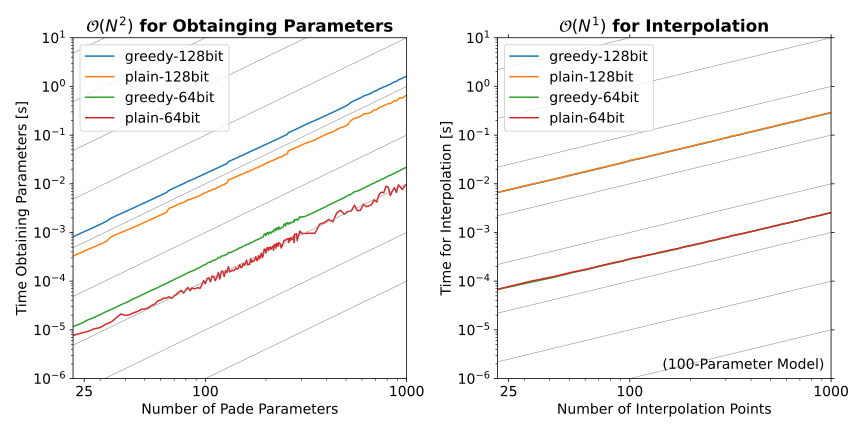

# General
This component of the library implements the analytic continuation approach for GW calculations
- thiele pade for AC
- what is AC 
- plot of AC 

# Benchmarks

## Analytic Continuation GW
### Self Energy
### Coulomb Interaction

## Analytic Continuation in RT-TDDFT 

## Model Functions
- which model functions where used 

### Convergence with Number of Parameters 

- plot with two functions

### Performance 
Creating the pade model (calling `create_thiele_pade()`) scales quadratically with the number of pade parameters (see left side of the figure below). The model settings influence the runtime as well. Using a higher precision internally will result in a higher runtime. Additionally, using the greedy algorithm for parameter evaluation will also increase the runtime copared to the plain thiele pade algorithm.

Evaluating the pade model (calling `evaluate_thiele_pade_at()`) scales linear with the number of points that are evaluated (see left side of the figure below). The type of algorithm doesn't influence the runtime but using a higher precision internally will again result in a longer runtime.

<p align="center">
  
</p>


# Usage

There are two API functions that are needed in order to generate and evaluate a thiele pade interpolation.

To create the thiele pade parameters call `create_thiele_pade()` with the reference function arguments and values:
```fortran 
params_thiele = create_thiele_pade(n_par, x_ref, y_ref)
```
`x_ref`, `y_ref` must be of length `n_par`. After this step the parameters are stored in the struct called `params_thiele`.

The parameters dont need to be accessed. In order to use the pade model to evaluate function values with arbitrary function arguments you can use the API function `evaluate_thiele_pade_at()`:
```fortran
y_return =  evaluate_thiele_pade_at(params_thiele, x_query)
```
If the pade model is not needed anymore, the parameters can be conviniently deallocated by:
```fortran 
call free_params(params_thiele)
```


### Basic usage pade interpolation

> **Defaults**:
> - use the greedy algorithm
> - use 64 bit float precision (double precision) when GMP is not linked
> - use 128 bit float precision (quadrupel precision) when linked against GMP

```fortran
use gx_ac, only: create_thiele_pade, evaluate_thiele_pade_at, & 
                 free_params, params

type(params)                           :: params_thiele
complex(dp), dimension(:), allocatable :: x_ref
complex(dp), dimension(:), allocatable :: y_ref
complex(dp), dimension(:), allocatable :: x_query
complex(dp), dimension(:), allocatable :: y_return
integer                                :: n_par         ! number of pade parameters
integer                                :: n_fit         ! number of fitting points

allocate(x_ref(n_par), y_ref(n_par))
allocate(x_query(n_fit), y_return(n_fit)) 

! initialize x_ref, y_ref and x_quer
...

! create the pade interpolation model and store it in struct
params_thiele = create_thiele_pade(n_par, x_ref, y_ref)

! evaluate the pade interpolation model at given x points
y_return(1:n_fit) =  evaluate_thiele_pade_at(params_thiele, x_query)

! Clean-up
call free_params(params_thiele)
```
This is an excerpt of a stand-alone example program that can be found in `greenX/GX-AnalyticContinuation/examples/`. You can use this script to test the GX-AC component using a model function.

### Advanced usage pade interpolation
e.g. using the plain thiele pade algorithm (non-greedy) with 256 bit float precision (8-fold precision): 
```fortran
params_thiele = create_thiele_pade(n_par, x_ref, y_ref, do_greedy=.false., precision=256)
```
e.g. using the greedy algorithm with the faster double precision fortran implementation (doesn't make use of GMP even if it is linked) :
```fortran
params_thiele = create_thiele_pade(n_par, x_ref, y_ref, do_greedy=.true., precision=64)
```
All possible combinations of `do_greedy` and `precision` are supported. 

**Some considerations**:
- 64 bit precision is faster than any other precision (because only fortran is used, no GMP)
- `do_greedy=.true.` is slower than `do_greedy=.false.` 
- the routines scale $\mathcal{O}(N^2)$ in memory where $N$ is the number of pade parameters 


### Availability of GMP at runtime

It is possible to check whether GMP is linked against GreenX at runtime:
```fortran
use gx_ac, only: arbitrary_precision_available, create_thiele_pade

if (arbitrary_precision_available) then
    ! this will succeed
    params_thiele = create_thiele_pade(n_par, x_ref, y_ref, do_greedy=.false., precision=320)
else if (.not. arbitrary_precision_available) then 
    ! this will result in an error
    params_thiele = create_thiele_pade(n_par, x_ref, y_ref, do_greedy=.false., precision=320)
end if   
```


<button onclick="goBack()">Go Back</button>

<script>
function goBack() {
  window.history.back();
}
</script>
