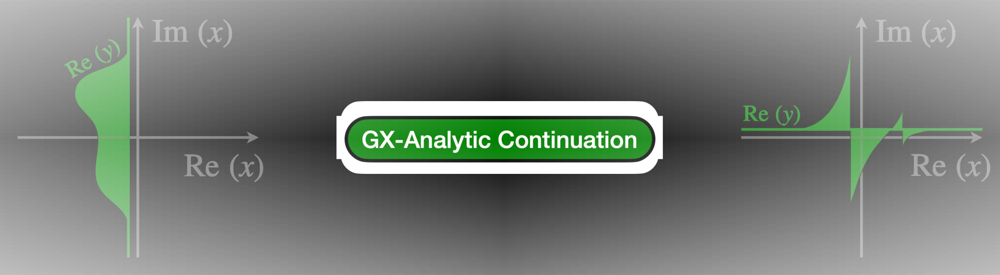
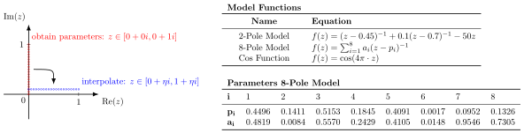
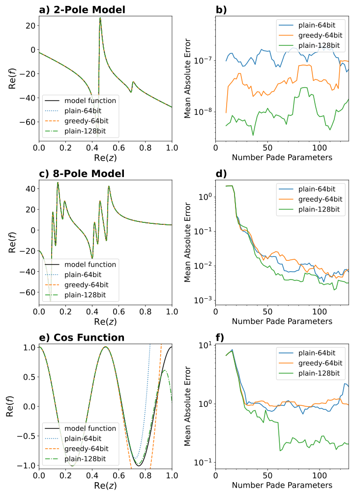
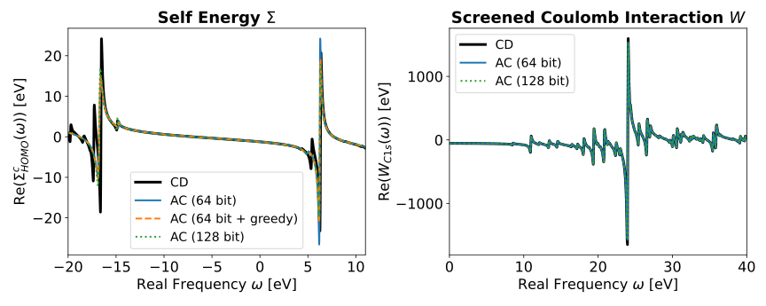
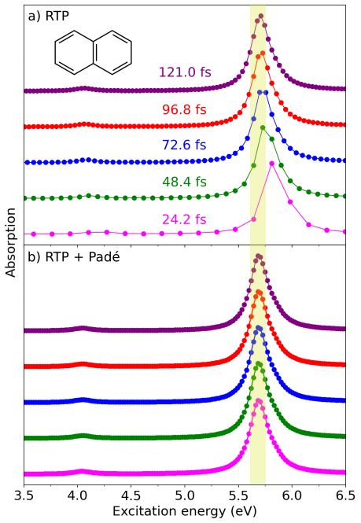

# General
This component of the GreenX library (GX-AC) implements the analytic continuation using Padé approximants.

<div style="display:flex; justify-content: center; align-items: center; padding-bottom: 20px; padding-top: 20px">
  
</div>

Analytic continuation is a common challenge in theoretical chemistry when you have a complex analytic function $f(z)$ defined in one domain but need it in another. This issue can be addressed using Padé approximants, which are fitted to the function in one domain (such as the imaginary axis) and then evaluated in a different domain (such as the real axis). These Padé approximants are rational functions of the form
```math
 f(z) \approx T_{M}(z) = \frac{A_0 + A_1z + \cdots + A_pz^p + \cdots + A_{\frac{M-1}{2}}z^{\frac{M-1}{2}}}{1 + B_1z + \cdots + B_pz^p + \cdots + B_{\frac{M}{2}}z^{\frac{M}{2}}}.
 ```

The GX-AC component uses the Thiele's reciprocal differences algorithm (A.B. George, Essentials of Padé Approximants, Elsevier 1975) to obtain the Padé parameters in a continued fraction form that is [equivalent](https://pubs.acs.org/doi/10.1021/acs.jctc.3c00555) to the rational functions form above
```math
T_M(z) = \cfrac{a_1}{1+ \cfrac{a_2(z - z_1)}{\quad\ddots\quad 1+ \cfrac{a_p(z-z_{p-1})}{1+\cfrac{a_{p+1}(z-z_p)}{\quad\ddots\quad 1+a_M(z-z_{M-1})}}}}
```

where $\{z_i\}$ are a set of reference points that are used to create the Padé model.  The following relation holds for every reference point:
```math
 f(z_i) = T_M(z_i)\qquad i = 1, \;\dots,\; M
 ```

the parameters $a_i$ are obtained by recursion:
```math 
a_i = g_i(z_i)\qquad i = 1, \;\dots,\; M 
```
```math 
g_p(z_i) = \begin{dcases}  f(z_i) & p=1 \\\;\\ \frac{g_{p-1}(z_{p-1})-g_{p-1}(z_i)}{(z_i - z_{p-1})g_{p-1}(z_i)} & p>1\end{dcases}
```

Padé approximants are known to be [numerical instable](https://doi.org/10.1093/imamat/25.3.267). The GX-AC component uses two strategies to numerically stabilize the interpolation. 
First, it incorporates a [greedy algorithm for Thiele Padé approximants](https://pubs.acs.org/doi/full/10.1021/acs.jctc.3c00555) that minimizes the numerical error by reordering of the reference points. A validation of the greedy algorithm can be found in this [reference](https://pubs.acs.org/doi/full/10.1021/acs.jctc.3c00555). Additionally it is possible to use the component with a  higher internal numerical floating point precision. This helps reducing the numerical noise caused by [catastrophic cancellation](https://doi.org/10.1145/103162.103163). Catastrophic cancellation occurs when rounding errors are amplified through the subtraction of rounded numbers, such as double-precision floating-point numbers commonly used in most programs. This is implemented using the [GNU Multiple Precision (GMP) library](https://gmplib.org/) which allows floating-point operations with customizable precision. Furthermore, it is possible to impose various symmetries onto the Padé model using the GX-AC component. To maximize performance, the evaluation of the Padé  model uses the [Wallis algorithm](https://numerical.recipes/book.html), which minimizes the number of divisions, an operation that is computationally expensive, especially for complex floating-point numbers and even more so for higher-precision complex numbers. The component also allows symmetry-constraint Padé models, for a full list of supported symmetries see the section "Usage". 


# Benchmarks

In this benchmark section, we first analyze the effect of various parameters by using simple model functions, providing insights into their behavior, and then demonstrate practical applications with GW and RT-TDDFT simulations. 

## Model Functions
This benchmark tests the numerical stability of the Padé interpolant of the GX-AC component using three model functions. In each case, a grid along the imaginary axis $z \in [0i, 1i]$  was used to determine the Padé parameters, followed by the evaluation of 1,000 function values on the real axis $z \in [0 + \eta i, 1 + \eta i]$ using the created Padé model. A small imaginary shift $\eta=0.01$ was introduced to avoid singularities in the tested pole models. The 1,000 computed points were then compared to the exact function values of the model functions to assess the mean absolute error.

<div style="display:flex; justify-content: center; align-items: center;">
  
</div>


### Convergence with Number of Padé Parameters 
The three model functions described above were tested with three different configurations of the GX-AC component:

- `"plain-64"`:  Thiele Padé algorithm using double-precision floating-point representation.
- `"greedy-64"`: Thiele Padé with a **greedy algorithm** and double-precision floating-point representation.
- `"plain-128"`: Thiele Padé algorithm using **quadruple-precision** (128 bit) floating points (internally).

It was observed that the greedy algorithm with quadruple precision performed similarly to "plain-128". Therefore, this configuration was left out of the plot.

The figure below illustrates how the number of parameters affects the error in analytic continuation. The error is defined as the residual sum between the values obtained from the Padé model and the exact analytic reference function.

On the left, the function along the real axis of $z$ is shown, comparing the analytic continuation of different 128-parameter Padé models with the exact reference function. On the right, the error from analytic continuation is plotted against the number of Padé parameters.

For a simple 2-pole model, increasing the number of parameters does not reduce the error because all features are already well-represented with a small number of parameters. In more complex models (such as the 8-pole model or cosine function), the error decreases as more Padé parameters are used, indicating better representation of these feature-rich functions.

For all three models, the 128-bit Padé approximant shows significantly lower error compared to the 64-bit version. Additionally, the greedy algorithm reduces the error further compared to the standard Thiele Padé method, particularly for the 2-pole model.


<div style="display:flex; justify-content: center; align-items: center;">
  <div style="width: 600px;">
  
  <br>
  <div style="display: block; padding: 20px; color: gray; text-align: justify;">
  Left: Comparison of the model function with the Padé interpolated function (128 parameters) along the real axis. Right: Mean absolute error between the correct model function and interpolated functions at 1,000 test points along the real axis.  
  </div>
  </div>
</div>

### Performance 
Creating the Padé model (calling `create_thiele_Padé()`) scales quadratically with the number of Padé parameters (see left side of the figure below). The model settings influence the runtime as well. Using a higher precision internally will result in a higher runtime. Additionally, using the greedy algorithm for parameter evaluation will also increase the runtime compared to the plain Thiele Padé algorithm.

Evaluating the Padé model (calling `evaluate_thiele_Padé_at()`) scales linear with the number of points that are evaluated (see left side of the figure below). The type of algorithm doesn't influence the runtime but using a higher precision internally will again result in a longer runtime.

<div style="display:flex; justify-content: center; align-items: center;">
  <div style="width: 800px;">
  
  <br>
  <div style="display: block; padding: 20px; color: gray; text-align: justify;">
    Performance Benchmark of the GX-AC component using the 2-pole model function. Left: Runtime of obtaining the Padé parameters depending on how many parameters were used. Right: Runtime of evaluating function values using the pade model with 100 parameters.
  </div>
  </div>
</div>

## Analytic Continuation in *GW*

The [*GW* method](https://doi.org/10.3389/fchem.2019.00377) stems from many body pertubation theory and is used for calculating electronic excitations in photoemission spectroscopy. Padé approximants are used in *GW* to continue analytic functions like the [self energy](https://dx.doi.org/10.1088/1367-2630/14/5/053020) $\Sigma(\omega)$ or the [coulomb interaction](https://doi.org/10.1021/acs.jctc.3c00555) $W(\omega)$ from the imaginary to the real frequency axis. 

In this test, we present GW calculations using [FHI-aims](https://fhi-aims.org/), where either the self energy or the screened interaction is interpolated using Padé approximants from the GX-AC component. The G<sub>0</sub>W<sub>0</sub>@PBE calculations use a NAO tier 1 basis set and 400 imaginary frequency points to obtain the Padé models. For comparison, we reference a G<sub>0</sub>W<sub>0</sub>@PBE calculation using the [contour deformation](https://doi.org/10.1021/acs.jctc.8b00458) (CD) approach to accurately obtain the self-energy and screened interaction on the real axis.

The plot demonstrates that, regardless of the GX-AC component settings (greedy/non-greedy algorithm and floating-point precision), the self-energy and screened interaction can be accurately described using Padé approximants.

<div style="display:flex; justify-content: center; align-items: center;">
  <div style="width: 900px;">
  
  <br>
  <div style="display: block; padding: 20px; color: gray; text-align: justify;">
  Left: Analytic continuation (AC) of the self energy of the highest occupied molecular orbital (HOMO) from the imaginary to the real frequency axis  and comparison to contour deformation.  All Padé approximants use 400 parameters.   Right: Analytic continuation of the screened interaction of a core 1s state (benzene) from the imaginary to the real frequency axis.   
  </div>
  </div>
</div>


## Analytic Continuation in RT-TDDFT 

[Real-time time-dependent density functional theory (RT-TDDFT)](https://doi.org/10.1021/acs.chemrev.0c00223) is one of the most popular and computationally efficient methods to simulate electron dynamics. RT-TDDFT relies on the propagation of the electron density in the time-domain under external perturbation. The response properties, such as the dynamic polarizability tensor, can be used to simulate the absorption and/or resonance raman spectroscopies. A single Fourier transformation is sufficient to obtain the full absorption spectrum from an RT-TDDFT run. This is a significant advantage compared to the more conventional linear-response (LR)-TDDFT which requires an iterative solvation scheme for each excitation energy. 

The RT-TDDFT calculations can still get computationally demanding with large system sizes, because obtaining a converged spectrum often requires long simulation times. However, [the use of Padé approximants](https://doi.org/10.1063/1.5051250) enables significantly shorter simulation times and higher resolution in the frequency domain. In this test, we present the absorption spectrum of the naphtalene molecule computed via RT-TDDFT as implemented in the [CP2K](https://www.cp2k.org/) program package. We used PBE functional, Goedecker–Teter–Hutter (GTH) pseudopotentials and TZV2P-GTH basis set for the RT-TDDFT simulations. We applied the initial perturbation in the form of a $\delta$-pulse and we set the field strength parameter to 0.001 au. Setting the RT-TDDFT time step to 0.00242 fs, we ran the simulation for up to 121 fs. We calculated the dipole moments of the whole simulation cell via the Berry phase approach for each RT-TDDFT step and we computed the polarizability tensors from the induced dipole moments. Using the [FFTW](https://www.fftw.org/) library, we applied fast fourier transformation to the polarizability tensors. Using the "plain-128" algorithm, we applied Pade approximants to the polarizabilities in the frequency domain. We calculated the absorption spectra ($S(\omega)$) using the dynamic polarizabilities $(\alpha_{\alpha\beta}^{\textnormal{el, RT}}(\omega ))$ as follows:

```math 
S(\omega) = \frac{4\pi\omega}{3c}\textnormal{Tr}\left\{ \textnormal{Im}(\alpha_{\alpha\beta}^{\textnormal{el, RT}}(\omega ))\right\}  
```
where $c$ denotes the speed of light. 

The upper plot (a) demonstrates the first absorption peak for naphthalene, generated from the RT-TDDFT trajectories of different simulation lengths. 121.0, 96.8, 72.6, 48.4 and 24.2 fs of simulation times correspond to 50000, 40000, 30000, 20000 and 10000 RT-TDDFT steps, respectively. It is clear that, especially in the spectrum of the 24.2 fs RT-TDDFT trajectory, the position of the absorption peak shifted to higher excitation energies due to lack of data points and low resolution in the data set. The lower plot (b) displays the absorption spectrum of naphthalene for the same excitation energy range, however, this time with the inclusion of the Padé approximants so that that the final number of data points is extended to 80000 in each spectrum. The results indicate that, thanks to the increased resolution, the use of Padé approximants allows reaching a converged absorption spectrum even with RT-TDDFT simulation times as short as 24.2 fs. This makes the total computation time $\approx$ 5 times shorter. 

<div style="display:flex; justify-content: center; align-items: center;">
  <div style="width: 900px;">
  
  <br>
  <div style="display: block; padding: 20px; color: gray; text-align: justify;">
   Absorption spectrum of naphthalene molecule calculated from the RT-TDDFT trajectories of different simulation lengths a) without applying Padé approximants and b) applying Padé approximants using the "plain-128" algorithm.   
  </div>
  </div>
</div>

# Usage

There are two API functions that are needed in order to generate and evaluate a Thiele Padé interpolation. To create the Thiele Padé parameters call `create_thiele_Pade()` with the reference function arguments and values:
```fortran 
params_thiele = create_thiele_pade(n_par, x_ref, y_ref)
```
`x_ref`, `y_ref` must be of length `n_par`. After this step the parameters are stored in a fortran type called `params_thiele`. The parameters don't need to be accessed. In order to use the Padé model to evaluate function values with arbitrary function arguments you can use the API function `evaluate_thiele_Pade_at()`:
```fortran
y_return =  evaluate_thiele_pade_at(params_thiele, x_query)
```
`y_return` and `x_query` must be arrays of the same length. If the Padé model is not needed anymore, the parameters can be conveniently deallocated by:
```fortran 
call free_params(params_thiele)
```


### Example of a Basic Padé Interpolation

```fortran
use gx_ac, only: create_thiele_pade, evaluate_thiele_pade_at, & 
                 free_params, params

type(params)                           :: params_thiele
complex(dp), dimension(:), allocatable :: x_ref
complex(dp), dimension(:), allocatable :: y_ref
complex(dp), dimension(:), allocatable :: x_query
complex(dp), dimension(:), allocatable :: y_return
integer                                :: n_par         ! number of Padé parameters
integer                                :: n_fit         ! number of fitting points

allocate(x_ref(n_par), y_ref(n_par))
allocate(x_query(n_fit), y_return(n_fit)) 

! initialize x_ref, y_ref and x_quer
...

! create the Padé interpolation model and store it in struct
params_thiele = create_thiele_pade(n_par, x_ref, y_ref)

! evaluate the Padé interpolation model at given x points
y_return(1:n_fit) =  evaluate_thiele_pade_at(params_thiele, x_query)

! Clean-up
call free_params(params_thiele)
```
This is an excerpt of a stand-alone example program that can be found in `greenX/GX-AnalyticContinuation/examples/`. You can use this script to test the GX-AC component functionalities using a model function.

### Available Options of Padé Interpolation
Fine-grained control over the generated pade model is provided by calling `create_thiele_pade()`with optional keyword arguments:
```fortran
params_thiele = create_thiele_pade(n_par, x_ref, y_ref,     &
                                   do_greedy = .true.,      &
                                   precision = 64,          &
                                   enforce_symmetry = "none")
y_return =  evaluate_thiele_pade_at(params_thiele, x_query)
```
The chosen options are stored in the model type and don't have to be repeated when the model is evaluated. All possible combinations of `do_greedy`, `precision` and `enforce_symmetry` options are supported. 

#### keyword argument `do_greedy` 
**Default:** `.true.` <br>
**Possible options:** `.true.`, `.false.`<br>
If true, a greedy algorithm is used to sort the reference points with the aim to lower the numerical noise. This comes at the cost of a slightly increased time to create the pade model. 

#### keyword argument `precision` 
**Default:** `128` if linked against GMP, else: `64`<br>
**Possible options:** any positive number greater zero of type `integer` <br>
The internal floating point precision in bit (not byte). Controls how floats are represented during creation and evaluation of the model using the GNU MP library for handling higher precision floats if a precision greater that 64 bit (double precision) is requested. The arrays containing the reference points (input) and also the evaluated function values (output) are in double precision independent of the `precision` keyword value. Note that a higher precision can increase the time of creating and evaluating the pade model drastically.

#### keyword argument `enforce_symmetry` 
**Default:** `none` <br>
**Possible options:** See table below. <br>
Force the Padé model to have a certain symmetry. If the symmetry of the underlying function is known, the user is advised to enforce this symmetry on the Padé model. This increases the predictive power of the model because more information about the function is provided.

| symmetry label | enforced symmetry | 
| --- | --- |
| `mirror_real` |  $f(z) = f(a+ib) = f(-a+ib)$ |
| `mirror_imag`  | $f(z) = f(a+ib) = f(a-ib)$ |
| `mirror_both` | $f(z) = f(a+ib) = f(a-ib) = f(-a+ib) = f(-a-ib) $ |
| `even` | $f(z) = f(-z)$ |
| `odd` | $f(z) = -f(-z)$ |
| `conjugate` | $f(z) = \overline{f(-z)}$ |
| `anti-conjugate` | $f(z) = -\overline{f(-z)}$ |
| `none` |  no symmetry enforced |


### Availability of GMP at runtime

It is possible to check whether GMP is linked against GreenX at runtime:
```fortran
use gx_ac, only: arbitrary_precision_available, create_thiele_pade

if (arbitrary_precision_available) then
    ! this will succeed
    params_thiele = create_thiele_pade(n_par, x_ref, y_ref, do_greedy=.false., precision=320)
else if (.not. arbitrary_precision_available) then 
    ! this will result in an error
    params_thiele = create_thiele_pade(n_par, x_ref, y_ref, do_greedy=.false., precision=320)
end if   
```


<button onclick="goBack()">Go Back</button>

<script>
function goBack() {
  window.history.back();
}
</script>
