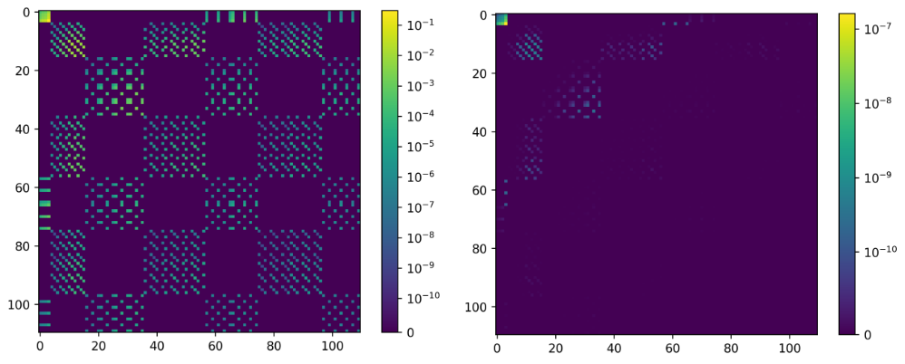

## GreenX library - LAPW (Linearized Augmented Plane Wave)

The cubic scaling GW method is implemented in exciting following 
the approach described by Kutepov et al[@kutepov2017linearized].
A key distinction between Kutepov's methodology and ours lies in 
their utilization of Matsubara frequencies, whereas we employ 
the zero-temperature approach relying on imaginary time.

## Benchmark
<h1 align="center">
  
</h1>
Color plot of polarizability matrix in MT-MT case. The left panel 
shows the cubic-scaling polarizability and right panel shows 
the difference between the cubic and quartic polarizability matrix.

<button onclick="goBack()">Go Back</button>

