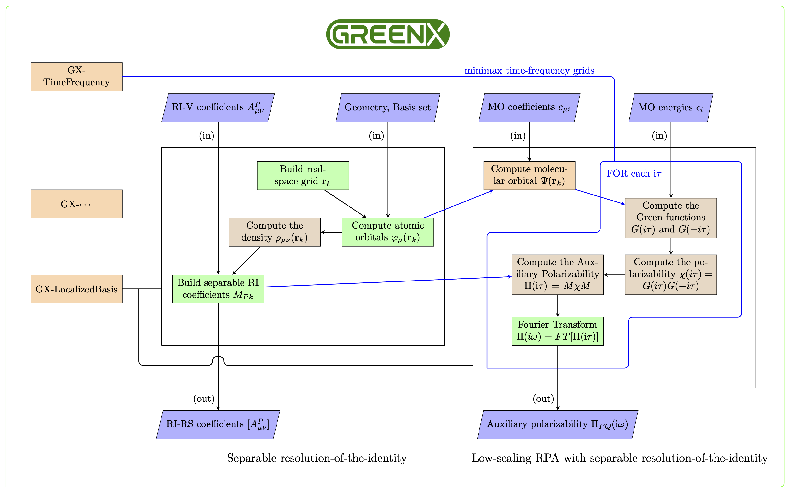
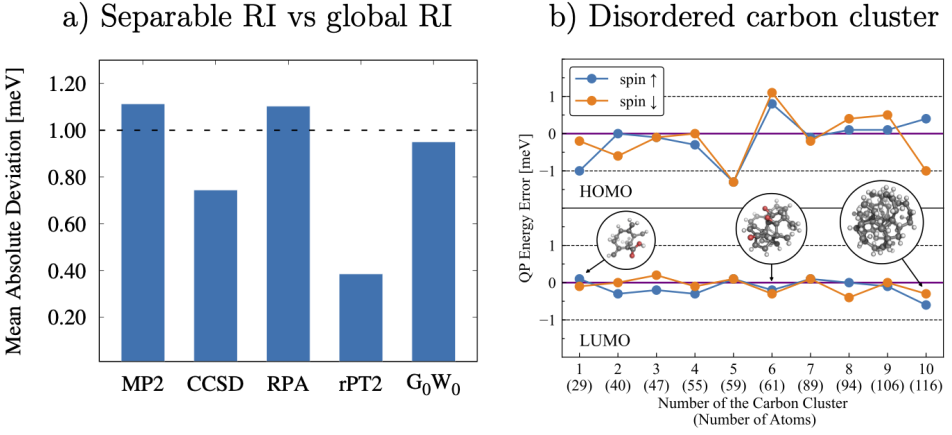

## General
This library provides a list localized basis set procedure, commonly occurring in post-scf calculations like MP2, RPA and GW approaches.

At the current stage, localized basis component of the GreenX library provide the separable resolution of the identity fitting coefficients to be used for the calculation of exact exchange energy, canonical RPA and GW methodologies. Also it can be used for the cubic-scaling RPA and GW, this feature is under development.

## Structure of the library
Workflow of the separable RI and cubic-scaling RPA with separable RI implementations as part of the GX-LocalizedBasis component of GreenX.

<h1 align="center">
  
</h1>

## Benchmark
<h1 align="center">
  
</h1>
a) Mean absolute deviations [meV] of separable RI with respect to RI-V utilizing the Thiel benchmark set. b) G0W0 quasiparticle energies errors of separable RI with respect to RI-V. Disordered carbon clusters containing carbon, hydrogen and oxygen atoms up to 116 atoms were used for these calculations

<button onclick="goBack()">Go Back</button>

