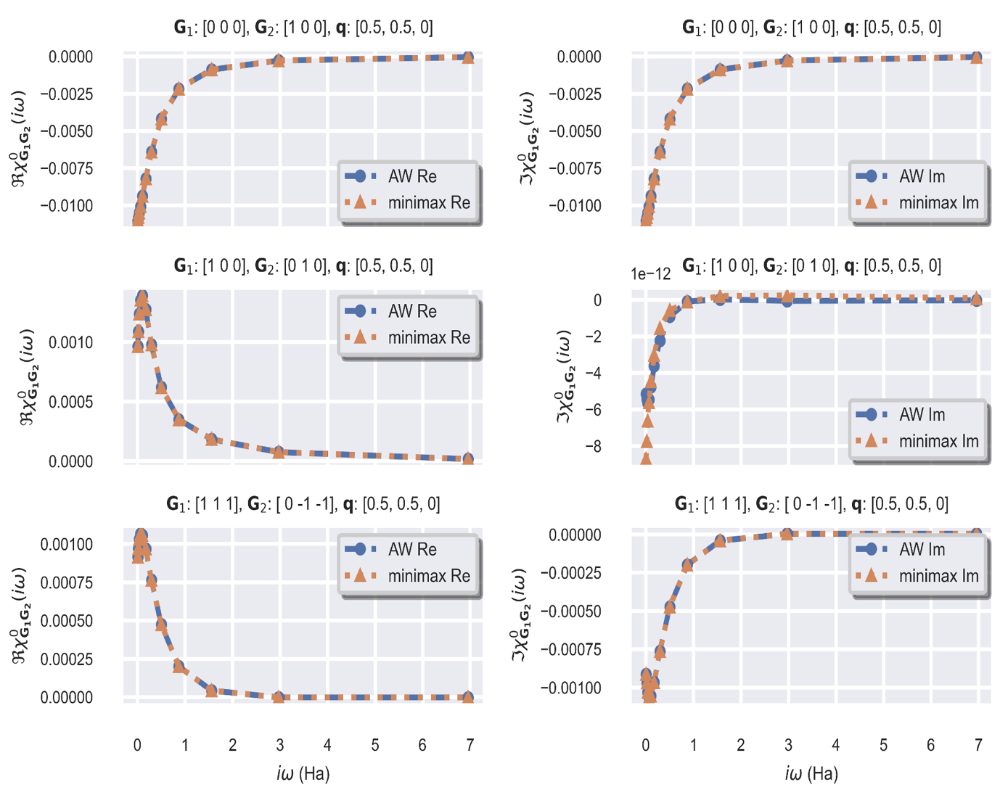

## GreenX library - PAW 

This implementation of the cubic scaling GWR algorithm 
takes advantage of well-established HPC libraries. 
More specifically, all the two-point functions are 
distributed with PBLAS and the diagonalization of 
the Kohn-Sham as well as the inversion of the 
dielectric matrix can be performed either with 
Scalapack or ELPA.

Different kinds of self-consistency have been implemented: 
from the simplest one-shot GW method to the more involved 
energy-only self-consistency in which one can update the 
quasiparticle energies either in the screened interaction 
or in the Green’s function entering the self-energy or in both. 
RPA total energies for solids can be computed as well starting 
from the polarizability in Fourier space and imaginary domain. 

At present the GWR code in ABINIT supports norm-conserving pseudopotentials only.

## Benchmark
<h1 align="center">
  
</h1>
Comparison between susceptibility of silicon calculated using 
Adler-Wiser formula (blue) and the real space imaginary-time 
minimax method (orange), with excellent agreement. 
The left column shows the real part of the susceptibility, 
and the right column shows the imaginary part of the 
susceptibility. Note the vertical scale of the middle right 
figure, that is to be multiplied by the indicated \\(10^{-12}\\) factor.

See the [GreenX website](https://nomad-coe.github.io/greenX/) for more details. 
