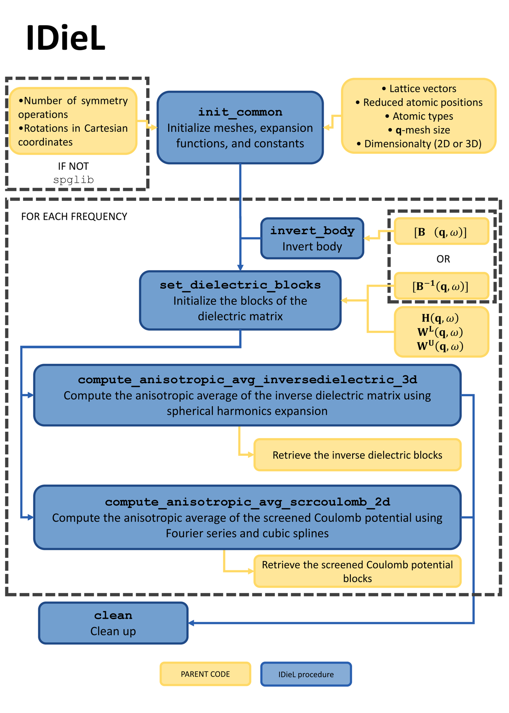
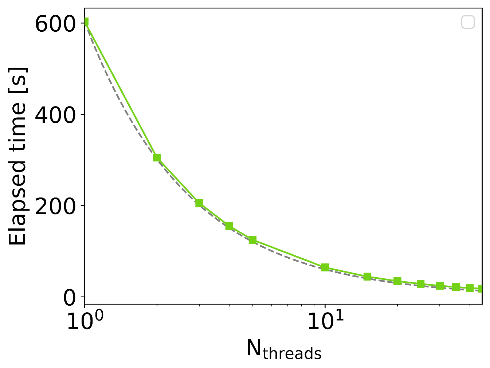
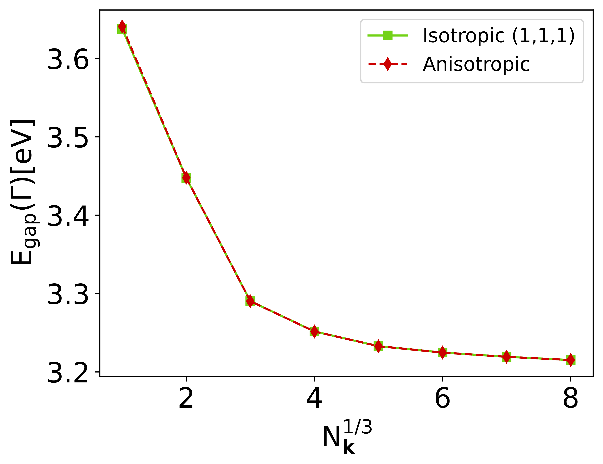

# General
This is a code-agnostic component of Green-X, aimed at computing the inverse dielectric constant for 3D systems, and the screened Coulomb potential for 2D systems at q=0. It has been adapted to GPUs.

## Structure of the library
Workflow of IDieL, indicating its interaction with the parent/calling code, and the major procedures. \(H\)
\(W^{L}\), \(W^{U}\) and \(B\) stand for the head, lower wing, upper wing and body of the dielectric matrix, respectively.

<h1 align="center">
  
</h1>

To compute quantities at  for a given frequency, the parent code must provide IDieL with the addresses of different object blocks (head, wings, and the inverse of the body), and indicate whether purely imaginary frequencies are utilized. This enables specific algorithms to exploit the Hermiticity of the blocks, enhancing computational efficiency. Alternatively, the library also facilitates the inversion of the body using internal functions; in such cases, the address of the body term should be provided instead of its inverse. Then, after the computation the quantities of interest can be copied back to the parent code. Finally, after all the computations, the parent code also needs to make a final call to clean up any resources.

## Scaling benchmark
<h1 align="center">
  
</h1>
Execution time for 3D anisotropic averaging of bulk Si with 438 basis functions and 12 frequency points as a function of the number of threads (green). All runs were performed on an Intel(R) Cascade Lake Platinum 9242. The ideal scaling is depicted for reference (dashed-gray).

## Validation benchmark
<h1 align="center">
  
</h1>
Band gap at \(\Gamma\) as a function of mesh size for bulk Si, computed using the isotropic (green-solid) and anisotropic (red-dashed) approaches. All calculations have been done with exciting.

<button onclick="goBack()">Go Back</button>

