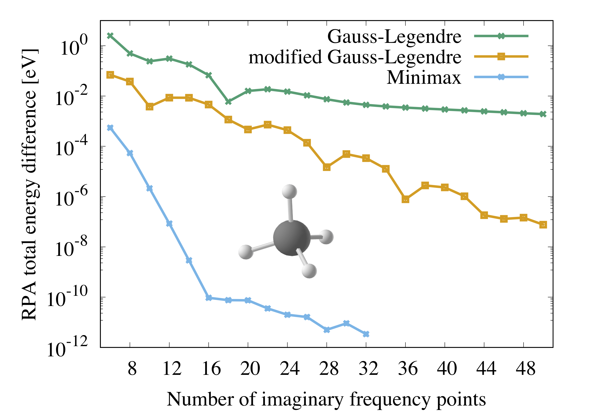

# General

The time-frequency component of GreenX provides minimax time and frequency grids and the corresponding quadrature weights for the numerical evaluation of time and frequency integrals as well as the weights for Fourier transforms between time and frequency grids. The minimax grids are primarily relevant for low-scaling RPA and GW algorithms, which use the [space-time method](https://journals.aps.org/prl/abstract/10.1103/PhysRevLett.74.1827). However, the compact minimax frequency grids also reduce the computational prefactor in RPA codes with conventional scaling. In addition, the time grids can be employed in Laplace-transformed direct MP2 (LT-dMP2) calculations.

# Benchmarks

## Correlation energy from conventional RPA for CH<sub>4</sub>

In this test, we evaluate the RPA total energy of a single CH<sub>4</sub> molecule using a regular Gauss-Legendre grid, a modified Gauss-Legendre grid (so far the standard in FHI-aims and abinit), and the minimax grids from the Green-X library. The plot is generated with the canonical RPA implementation in FHI-aims using the PBE functional for the preceding DFT calculation and numeric atom-centered orbitals (NAOs) of Tier2 quality. The conventional RPA implementation in FHI-aims is based on the global resolution-of-the-identity technique with the Coulomb metric (RI-V). The auxiliary basis functions for the RI-V method were generated automatically on the fly.

The plot shows that the minimax RPA energies converge significantly faster with respect to grid size than the ones from regular and modified Gauss-Legendre grids. An accuracy of \\10^{-6}\\ eV is reached with 10 minimax grid points, while the modified Gauss-Legendre grids requires 36 points to reach the same accuracy.

<p align="center">
  
</p>

<em>
Difference of the RPA total energy of an isolated methane molecule comparing regular and modified Gauss-Legendre grids and minimax grids. The differences are computed with respect to the lowest RPA energy obtained with 34 minimax grid points.</em>

## GW100

Some minimax grids published in GreenX were used in previous work, e.g., DOI:[110.1021/acs.jctc.0c01282](https://pubs.acs.org/doi/10.1021/acs.jctc.0c01282). In this reference, a subset of the GreenX authors performed benchmark tests for the low-scaling GW implementation in the CP2K program package for different grid sizes using the [GW100 test set](https://pubs.acs.org/doi/10.1021/acs.jctc.5b00453). The authors presented benchmark results for grids with 10, 20, 26,28, 30, 32 and 34 grid points and showed that the mean absolute deviations (MADs) compared to a conventional-scaling GW code with converged out grid settings systematically improve with the number of minimax grid points reaching MADs < 10 meVs.

## Further tests

A paper with comprehensive tests on molecules and periodic systems is in preparation. 

## Usage

The minimax grid generation is called like so:

```fortran
use gx_minimax, only: gx_minimax_grid

! Declarations
integer :: n_mesh_points
real(dp) :: e_transition_min, e_transition_max
real(dp), allocatable :: tau_mesh(:), tau_weights(:)
real(dp), allocatable :: freq_mesh(:), freq_weights(:)
real(dp), allocatable :: cos_tau_to_freq_weights(:, :)
real(dp), allocatable :: cos_freq_to_tau_weights(:, :)
real(dp), allocatable :: sinft_tau_to_freq_weights(:, :)
real(dp) :: max_errors(3)
real(dp) :: cosft_duality_error
integer :: ierr

call gx_minimax_grid(n_mesh_points, e_transition_min, e_transition_max, &
                     tau_mesh, tau_weights, &
                     freq_mesh, freq_weights, &
                     cos_tau_to_freq_weights, cos_freq_to_tau_weights, &
                     sinft_tau_to_freq_weights, &
                     max_errors, cosft_duality_error, ierr)
```

A detailed description of the quantities involved in the computation can be found on the [JOSS manuscript](https://raw.githubusercontent.com/openjournals/joss-papers/joss.05570/joss.05570/10.21105.joss.05570.pdf) of the library. Here we focus on mapping them with the variables used in the subroutine's interface:

| Output                                  |Variable  |Description                     |
|-----------------------------------------|-----------------------------|--------------------------------|
| \\(n\\)                                 | `n_mesh_points`             |grid size                       |
| \\(\\Delta_{\\text{min}}\\)             | `e_transition_min`          |minimum eigenvalue difference   |
| \\(\\Delta_{\\text{max}}\\)             | `e_transition_max`          |maximum eigenvalue difference   |
| \\(\\{\tau_j^\text{mat}\\}_{j=1}^n\\)   | `tau_mesh`                  |time points                     |
| \\(\\{\sigma_j^\text{mat}\\}_{j=1}^n\\) | `tau_weights`               |time integration weights        |
| \\(\\{\omega_k^\text{mat}\\}_{k=1}^n\\) | `freq_mesh`                 |frequency points                |
| \\(\\{\gamma_k^\text{mat}\\}_{k=1}^n\\) | `freq_weights`              |freq. integration weights       |
| \\(\\{\delta_{kj}\\}_{k,j=1}^n\\)       | `cos_tau_to_freq_weights`   |Fourier weights                 |
| \\(\\{\eta_{jk}\\}_{k,j=1}^n\\)         | `cos_freq_to_tau_weights`   |Fourier weights                 |
| \\(\\{\lambda_{kj}\\}_{k,j=1}^n\\)      | `sinft_tau_to_freq_weights` |Fourier weights                 |
| \\(\Delta_\text{CT}\\)                  | `cosft_duality_error`       |duality error cosine transforms |

We invite the reader to read the code in `src/minimax_grids.F90` for additional insight. For an example of how to call `gx_minimax_grid`, please consult `test/test_gx_minimax_grid.f90`. Additionally, one can also call a utility routine to query whether the number of imaginary-time points has a corresponding grid tabulation:

```fortran
use api_utilites, only: gx_check_ntau, gx_get_error_message

call gx_check_ntau(ntau, msg, ierr)
```

<button onclick="goBack()">Go Back</button>

<script>
function goBack() {
  window.history.back();
}
</script>
